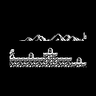
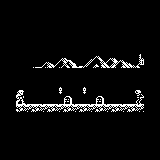

# CastleBoy — Watara Supervision port

A port of **CastleBoy**, the Castlevania-like Arduboy game by **@ZappedCow
(dir3kt)** and **@Increment (jlauener)**, to the **Watara Supervision**
(65C02, 160×160 @ 2bpp) using the **cc65** toolchain.

CastleBoy is © 2016 dir3kt / jlauener and released under the **MIT License**
(see `LICENSE.castleboy`). This port reuses the original game's real art, maps
and game logic under those terms, and preserves the copyright/license notice as
the license requires. Original CastleBoy: https://github.com/jlauener/CastleBoy

 


*(Frames above are rendered by the actual ported C rendering code — see
"How it was validated".)*

## Controls

| Button | Action |
|--------|--------|
| D-pad L/R | Move |
| D-pad Down | Duck |
| D-pad Up | Throw knife (if you have any) |
| A | Jump |
| B | Attack (whip) |
| START | Confirm on menus |

You enter a level from the left and finish by exiting on the **right**. Whip
candles to drop **coins** (score) and **knives** (ammo). Don't run out of time.

## Build

Requires cc65 (`cl65` on PATH), e.g. `apt-get install cc65`.

```sh
make            # -> castleboy.sv  (32 KB ROM)
make clean
```

Run in an emulator with the Potator core, or load `castleboy.sv` in any
Supervision emulator / on hardware:

```sh
make start      # retroarch -L .../potator_libretro.so castleboy.sv
```

## How it works (port architecture)

The Supervision's LCD is 160×160 @ 2 bits/pixel; CastleBoy targets the Arduboy's
128×64 @ 1bpp. The port keeps the original's pixel coordinates 1:1 but renders a
**wider 160-pixel-tall-by-64 view** of the world (the original only shows 128px
across), vertically centered on the screen.

**Rendering is built around the Supervision's hardware horizontal scroll** so the
4 MHz 65C02 never repaints the background while the camera moves:

* All art is pre-converted at build time to **Supervision 2bpp row-major** form
  (`gen_assets.py`), so the world is composed with plain **byte copies** — no
  per-pixel software shifting of the screen.
* A VRAM line is **48 bytes = 192 px** wide while only 160 px are visible, so the
  tile layer is drawn **directly into VRAM as a 192-px-wide strip** and the
  hardware **X_Scroll register** (`$2002`) slides the 160-px window across it.
  Within the 32-px slack, scrolling is **free** — just write one register, no
  drawing at all.
* The tile strip is only **redrawn on a "recharge"** — when the camera has moved
  past the 32-px slack. Standing still or scrolling inside the slack costs **zero
  tile work**. This is the dirty/scroll-buffer scheme that replaces the old
  "repaint every tile every frame".
* Moving sprites (player, entities, knife) and the HUD are drawn over the static
  strip each frame with **save-under**: the VRAM bytes a sprite will cover are
  saved into a small WRAM pool, the sprite is drawn, and next frame the saved
  bytes are restored before anything new is drawn — so the background under a
  sprite is reverted without repainting tiles. Sprites are still pixel-exact via
  a **constant-shift masked blit**, and every blitter clips its row range so a
  sprite that pokes above/below the play area can never write outside VRAM (the
  old out-of-bounds case is fixed).
* Drawing straight to VRAM means **no per-frame DMA copy** and frees the ~3 KB
  WRAM the old framebuffer needed (now used for the save-under pool).

Other layers:

* `platform.c` — the platform layer described above (direct-VRAM strip + hardware
  X-scroll + save-under + the byte/shift blitters), plus input (`SV_CONTROL`,
  active-low), `fill_rect` and `draw_number`. It exposes the original Arduboy
  drawing API (`spr_overwrite`/`spr_plus_mask`/`spr_self_masked`) so the game
  code is unchanged.
* `map.c`, `player.c`, `entity.c`, `game.c` — faithful C translations of the
  original `map.cpp`, `player.cpp`, `entity.cpp`, `game.cpp` (C++ namespaces →
  prefixed functions, references → pointers). Physics, tile auto-tiling, entity
  AI and the camera/HUD match the original.
* `assets.h` / `assets.c` — the original art pre-converted to 2bpp (+mask) and
  the maps, generated by `gen_assets.py`.
* `main.c` — entry point + a small state machine (title → stage intro → play →
  death/retry → level finished → game finished).

### Tooling
* `gen_assets.py` — pulls the needed sprites/maps out of the original
  `assets.h` into cc65-friendly `assets.h` + `assets.c`.
* `proto_render.py` — standalone Python that renders the pipeline to PNG (used
  to validate the blitter + auto-tiling before writing C).
* `hosttest/` — compiles the **actual port C code** with `gcc` (via a stub
  `supervision.h`) to render frames and stress-test the update loop on the host.

## How it was validated

Because the rendering is the riskiest part, it was checked end-to-end:
1. The pipeline was first prototyped in Python (`proto_render.py`) against the
   real assets and rendered stage 1-1 pixel-faithfully.
2. The **real ported C code** (the direct-VRAM scrolling renderer) was compiled
   on the host (`hosttest/`) and used to render `preview_stage_1_1.png` /
   `preview_stage_1_2.png`. The visible world matches the original software
   renderer **pixel-identically** (0 differing pixels over the shared 128-px
   region), confirming the 2bpp conversion, byte/shift blitters and strip layout.
3. The **scroll + save-under + recharge** logic was validated dynamically: a
   scrolling playthrough (walking right, jumping, throwing knives, whipping)
   compares the live incrementally-rendered VRAM against a fresh full redraw of
   the same game state at sparse checkpoints across recharges
   (`hosttest/scroll_ck.c`). All gameplay pixels — tiles, player, entities, HUD —
   match the full redraw **exactly** at every checkpoint.
4. The hardware **X_Scroll register** itself can't be exercised in the host
   harness (no LCD); it is programmed strictly per the reverse-engineering notes
   (`$2002`: upper 6 bits = byte offset into the line, lower 2 = sub-pixel delay)
   and should be confirmed on a Potator/real unit.
5. The update/physics/AI loop was stress-run with synthetic input with no crash,
   and the ROM builds clean at 32 KB with ~2 KB of WRAM used (plenty of stack).

> **Known cosmetic tradeoff — backdrop parallax.** The mountain backdrop uses the
> same single hardware scroll plane as the foreground, so true parallax isn't
> free. It is positioned for its parallax offset at each recharge but scrolls 1:1
> with the world in between, so it "steps" at recharge boundaries. Everything
> else is exact. Smooth parallax would require repainting the backdrop every
> frame (the per-frame background work this rewrite was asked to remove); it's
> left as a deliberate choice.

## Scope of this build

This is a faithful **Stage 1** slice — the three stage-1 levels (`stage_1_1..3`)
and every entity they use: candles → coin/knife pickups, walking and
bone-throwing skeletons, skulls, and falling platforms. The engine also already
ports the AI for birds, hurlers, the armored skeleton, moving platforms,
candlesticks and fireballs (their sprites are included), so adding the maps that
use them is just data.

Documented as straightforward extensions (kept out to fit the 32 KB cart and
keep this first cut focused):
* **Bosses** (knight / harpy / final) — their AI is omitted here and their data
  table slots point at a placeholder sprite; add the boss sprites + their maps
  and port the three `updateBoss*` functions from the original `entity.cpp`.
* **Stages 2–3** and the ending sequence — include those maps (`stage_2_*`,
  `stage_3_*`) in `gen_assets.py` and switch to the `supervision-64k` config.
* **Sound** — the original's `ArduboyTones` calls are currently no-ops; they can
  be mapped to the Supervision's audio channels.
* **Performance.** The renderer avoids the 6502's worst case (variable-distance
  bit shifts) and now also avoids repainting the background. The static tile
  strip is composed only on a recharge (every 32 px of camera travel); in between,
  scrolling is a single register write and **only the moving sprites + HUD touch
  VRAM**, via save-under. Standing still costs essentially nothing. There is no
  per-frame full-screen clear and no per-frame DMA. On top of that, the frame is
  only redrawn when something visible actually changed: the player and the enemies
  are tracked as two independent save-under groups (`player_drawSig` /
  `entities_drawSig`), so a moving player over idle enemies repaints only the
  player, and a frame where nothing moved is skipped entirely. Enemy death and
  item-fall animations were removed, so a killed enemy vanishes and its pickup
  appears in place with no extra per-frame sprite work.

  The headroom the earlier cut called out is now taken in the 64 KB banked build:
  pre-shifted player + enemy sprites live in ROM (bank 1/2) so there is no
  per-sprite variable shift, save-under bounds VRAM writes to each sprite's own
  rows (plus a HUD-band touch flag for partial HUD repaints), and the inner
  bank-copy/blit loop is hand-written assembly (`bankblit.s`), batched into a
  single bank round trip per sprite group. Remaining headroom is mostly data-side
  (fewer/pre-composed frames) rather than renderer structure.

## Credits / license

Watara Supervision port developed by **vrodin** and **Claude**.

CastleBoy game, art and maps: © 2016 dir3kt / jlauener — **MIT License**
(`LICENSE.castleboy`). This Supervision platform layer and port glue are provided
under the same terms.
